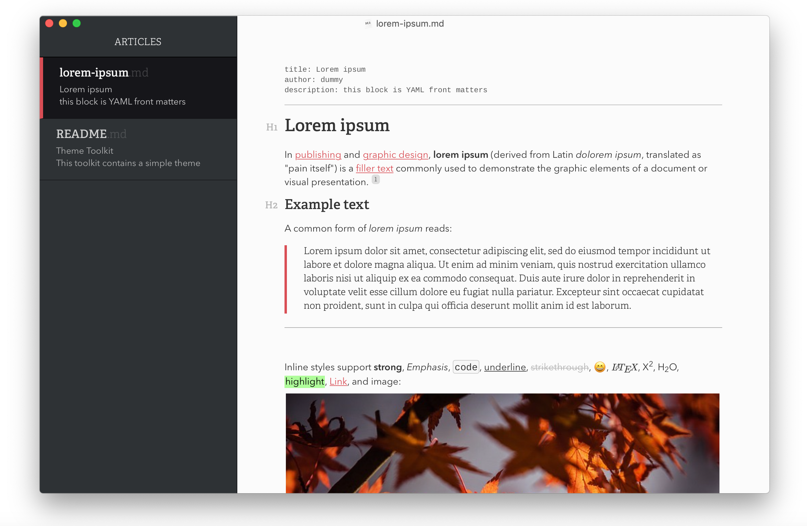

# 学习Markdown

## 目录 

[TOC]

## 1.Markdown的基本用法

## 1.1标题

使用“# ”表示标题的级别，如一级标题使用"# 1"，二级标题使用"## 2"，以此类推

## 1.2使用HTML语法

### 1.2.1一些HTML例子

下面是一些html片段，直接在这里使用就能看到效果

<table>
    <tr>
        <td>支持的HTML标签</td>
        <td>效果</td>
    </tr>
    <tr>
        <td>table标签</td>
        <td>表格</td>
    </tr>
</table>

<p>这是使用p标签写的段落</p>

<h3>这是h3标签写的段落</h3>

HTML 的区段（行内）标签如 “\<span\>”、\<cite\>、\<del\>可以在 Markdown 的段落、列表或是标题里随意使用。依照个人习惯，甚至可以不用 Markdown 格式，而直接采用 HTML 标签来格式化。举例说明：如果比较喜欢 HTML 的 \<a\> 或 \ 标签，可以直接使用这些标签，而不用 Markdown 提供的链接或是图像标签语法。

和处在 HTML 区块标签间不同，Markdown 语法在 HTML 区段标签间是有效的。

### 1.2.2特殊字符自动转换

在 HTML 文件中，有两个字符需要特殊处理： < 和 & 。 < 符号用于起始标签，& 符号则用于标记 HTML 实体，如果你只是想要显示这些字符的原型，你必须要使用实体的形式，像是 \&lt; 和 \&amp;。

& 字符尤其让网络文档编写者受折磨，如果你要打「AT&T」 ，你必须要写成「AT\&amp;T」。而网址中的 & 字符也要转换。比如你要链接到：

http://images.google.com/images?num=30&q=larry+bird

你必须要把网址转换写为：

http://images.google.com/images?num=30&q=larry+bird

才能放到链接标签的 href 属性里。不用说也知道这很容易忽略，这也可能是 HTML 标准检验所检查到的错误中，数量最多的。

Markdown 让你可以自然地书写字符，需要转换的由它来处理好了。如果你使用的 & 字符是 HTML 字符实体的一部分，它会保留原状，否则它会被转换成 \&amp;。

所以你如果要在文档中插入一个版权符号©，你可以这样写：

```html
&copy;
```

Markdown 会保留它不动。而若你写：

```html
AT&T
```

Markdown 就会将它转为：

```html
AT&amp;T
```

类似的状况也会发生在 < 符号上，因为 Markdown 允许 兼容 HTML ，如果你是把 < 符号作为 HTML 标签的定界符使用，那 Markdown 也不会对它做任何转换，但是如果你写：

```html
4 < 5
```

Markdown 将会把它转换为：

```html
4 &lt; 5
```

不过需要注意的是，code 范围内，不论是行内还是区块， < 和 & 两个符号都一定会被转换成 HTML 实体，这项特性让你可以很容易地用 Markdown 写 HTML code （和 HTML 相对而言， HTML 语法中，你要把所有的 < 和 & 都转换为 HTML 实体，才能在 HTML 文件里面写出 HTML code。）

## 1.2区块元素

### 1.2.1段落和换行

一个 Markdown 段落是由一个或多个连续的文本行组成，它的前后要有一个以上的空行（空行的定义是显示上看起来像是空的，便会被视为空行。比方说，若某一行只包含空格和制表符，则该行也会被视为空行）。普通段落不该用空格或制表符来缩进。

「由一个或多个连续的文本行组成」这句话其实暗示了 Markdown 允许段落内的强迫换行（插入换行符），这个特性和其他大部分的 text-to-HTML 格式不一样（包括 Movable Type 的「Convert Line Breaks」选项），其它的格式会把每个换行符都转成 \<br /> 标签。

如果你确实想要依赖 Markdown 来插入 \<br /> 标签的话，在插入处先按入两个以上的空格然后回车。

的确，需要多费点事（多加空格）来产生 \<br /> ，但是简单地「每个换行都转换为 \<br />」的方法在 Markdown 中并不适合， Markdown 中 email 式的 区块引用 和多段落的 列表 在使用换行来排版的时候，不但更好用，还更方便阅读。

### 1.2.2标题

Markdown 支持两种标题的语法，类 Setext 和类 atx 形式。

类 Setext 形式是用底线的形式，利用 = （最高阶标题）和 - （第二阶标题），例如：

```html
This is an H1
=============

This is an H2
-------------
```

任何数量的 = 和 - 都可以有效果。

类 Atx 形式则是在行首插入 1 到 6 个 # ，对应到标题 1 到 6 阶，例如：

```html
# 这是 H1

## 这是 H2

###### 这是 H6
```

你可以选择性地「闭合」类 atx 样式的标题，这纯粹只是美观用的，若是觉得这样看起来比较舒适，你就可以在行尾加上 #，而行尾的 # 数量也不用和开头一样（行首的井字符数量决定标题的阶数）：

```html
# 这是 H1 #

## 这是 H2 ##

### 这是 H3 ######
```

### 1.2.3区块引用

使用 ">"符号

> 鲁迅曾经说过：“晚安”

Markdown 标记区块引用是使用类似 email 中用 > 的引用方式。如果你还熟悉在 email 信件中的引言部分，你就知道怎么在 Markdown 文件中建立一个区块引用，那会看起来像是你自己先断好行，然后在每行的最前面加上 > ：

```md
> This is a blockquote with two paragraphs. Lorem ipsum dolor sit amet,
> consectetuer adipiscing elit. Aliquam hendrerit mi posuere lectus.
> Vestibulum enim wisi, viverra nec, fringilla in, laoreet vitae, risus.
> 
> Donec sit amet nisl. Aliquam semper ipsum sit amet velit. Suspendisse
> id sem consectetuer libero luctus adipiscing.

```

Markdown 也允许你偷懒只在整个段落的第一行最前面加上 > ：

```md
> This is a blockquote with two paragraphs. Lorem ipsum dolor sit amet,
consectetuer adipiscing elit. Aliquam hendrerit mi posuere lectus.
Vestibulum enim wisi, viverra nec, fringilla in, laoreet vitae, risus.

> Donec sit amet nisl. Aliquam semper ipsum sit amet velit. Suspendisse
id sem consectetuer libero luctus adipiscing.

```

区块引用可以嵌套（例如：引用内的引用），只要根据层次加上不同数量的 > ：

```md
 This is the first level of quoting.
>
> > This is nested blockquote.
>
> Back to the first level.

```

> 这是引用
>
> > 这是引用中的引用

> 这是一大段引用，只用了
>
> 一个“>”符号
>
> 。

引用的区块内也可以使用其他的 Markdown 语法，包括标题、列表、代码区块等：

```md
> ## 这是一个标题。
> 
> 1.   这是第一行列表项。
> 2.   这是第二行列表项。
> 
> 给出一些例子代码：
> 
>     return shell_exec("echo $input | $markdown_script");

```

> ## 这是引用的标题，不会记录在目录里面

### 1.2.4列表

Markdown 支持有序列表和无序列表。

无序列表使用星号、加号或是减号作为列表标记：

```md
*   Red
*   Green
*   Blue

```

等同于：

```md
+   Red
+   Green
+   Blue

```

也等同于：

```md
-   Red
-   Green
-   Blue

```

- 这是列表
- 感觉和evernote差不多
- emem...

1. 这是编号，使用了数字加英文句点
2. 那岂不是美国人都。。。是编号

<ol>
    <li>说实话</li>
    <li>这段是使用html来实现的</li>
</ol>

列表项目可以包含多个段落，每个项目下的段落都必须缩进 4 个空格或是 1 个制表符：

```md
1.  This is a list item with two paragraphs. Lorem ipsum dolor
    sit amet, consectetuer adipiscing elit. Aliquam hendrerit
    mi posuere lectus.

    Vestibulum enim wisi, viverra nec, fringilla in, laoreet
    vitae, risus. Donec sit amet nisl. Aliquam semper ipsum
    sit amet velit.

2.  Suspendisse id sem consectetuer libero luctus adipiscing.

```

如果你每行都有缩进，看起来会看好很多，当然，再次地，如果你很懒惰，Markdown 也允许：

```md
*   This is a list item with two paragraphs.

    This is the second paragraph in the list item. You're
only required to indent the first line. Lorem ipsum dolor
sit amet, consectetuer adipiscing elit.

*   Another item in the same list.

```

如果要在列表项目内放进引用，那 > 就需要缩进：

```md
*   A list item with a blockquote:

    > This is a blockquote
    > inside a list item.

```

如果要放代码区块的话，该区块就需要缩进两次，也就是 8 个空格或是 2 个制表符：

```md
*   一列表项包含一个列表区块：

        <代码写在这>

```

### 1.2.5代码区块

使用"```<语言>"可以产生语言代码块

使用“\<pre>\<code>”也能产生代码块

<pre><code>
    这是一个普通的代码区域块
</code></pre>

一个代码区块会一直持续到没有缩进的那一行（或是文件结尾）。

在代码区块里面， & 、 < 和 > 会自动转成 HTML 实体，这样的方式让你非常容易使用 Markdown 插入范例用的 HTML 原始码，只需要复制贴上，再加上缩进就可以了，剩下的 Markdown 都会帮你处理，例如：

```md
<div class="footer">
  &copy; 2004 Foo Corporation
</div>

```

会被转换为：

```md
<pre><code>&lt;div class="footer"&gt;
    &amp;copy; 2004 Foo Corporation
&lt;/div&gt;
</code></pre>

```

代码区块中，一般的 Markdown 语法不会被转换，像是星号便只是星号，这表示你可以很容易地以 Markdown 语法撰写 Markdown 语法相关的文件

### 1.2.6分割线

使用"***"、"- - -"等产生分割线，如下

------

### 1.2.7区段元素

#### 1.2.7.1链接

使用"\[\]\(\)"来产生，如“\[\](url "alt")”

[哔哩哔哩](www.bilibili.com "这个是alt元素")

[百度](www.baidu.com "百度一下，你就知道")

Markdown 支持两种形式的链接语法： 行内式和参考式两种形式。

不管是哪一种，链接文字都是用 [方括号] 来标记。

要建立一个行内式的链接，只要在方块括号后面紧接着圆括号并插入网址链接即可，如果你还想要加上链接的 title 文字，只要在网址后面，用双引号把 title 文字包起来即可，例如：

```md
This is [an example](http://example.com/ "Title") inline link.

[This link](http://example.net/) has no title attribute.

```

会产生：

```md
<p>This is <a href="http://example.com/" title="Title">
an example</a> inline link.</p>

<p><a href="http://example.net/">This link</a> has no
title attribute.</p>

```

如果你是要链接到同样主机的资源，你可以使用相对路径：

```md
See my [About](/about/) page for details.

```

参考式的链接是在链接文字的括号后面再接上另一个方括号，而在第二个方括号里面要填入用以辨识链接的标记：

```md
This is [an example][id] reference-style link.

```

你也可以选择性地在两个方括号中间加上一个空格：

```md
This is [an example] [id] reference-style link.

```

接着，在文件的任意处，你可以把这个标记的链接内容定义出来：

```md
[id]: http://example.com/  "Optional Title Here"

```

参考链接如下：[这是一个参考链接][1]

链接内容定义的形式为：

- 方括号（前面可以选择性地加上至多三个空格来缩进），里面输入链接文字
- 接着一个冒号
- 接着一个以上的空格或制表符
- 接着链接的网址
- 选择性地接着 title 内容，可以用单引号、双引号或是括弧包着

还有一种用法，如[谷歌][]

#### 1.2.7.1强调

Markdown 使用星号（*）和底线（_）作为标记强调字词的符号，被 * 或 _ 包围的字词会被转成用 \<em> 标签包围，用两个 * 或 _ 包起来的话，则会被转成 <strong>，例如：

```md
*single asterisks*   这是斜体

_single underscores_

**double asterisks**  这是粗体

__double underscores__

```

会转成：

```md
<em>single asterisks</em>

<em>single underscores</em>

<strong>double asterisks</strong>

<strong>double underscores</strong>

```

你可以随便用你喜欢的样式，唯一的限制是，你用什么符号开启标签，就要用什么符号结束。

强调也可以直接插在文字中间：

```md
un*frigging*believable

```

但是**如果你的 \* 和 _ 两边都有空白的话，它们就只会被当成普通的符号。**

如果要在文字前后直接插入普通的星号或底线，你可以用反斜线：

```md
\*this text is surrounded by literal asterisks\*

```

**这是一段强调的文字**，*这段使用了下划线*

#### 1.2.7.3小段代码

如果要标记一小段行内代码，你可以用反引号把它包起来（`），例如：

```md
Use the `printf()` function.

```

Use the `printf()` function

如果要在代码区段内插入反引号，你可以用多个反引号来开启和结束代码区段：

```md
``There is a literal backtick (`) here.``

```

``There is a literal backtick (`) here.``

### 1.2.8图片

很明显地，要在纯文字应用中设计一个「自然」的语法来插入图片是有一定难度的。

Markdown 使用一种和链接很相似的语法来标记图片，同样也允许两种样式： 行内式和参考式。

行内式的图片语法看起来像是：

```md


```

详细叙述如下：

- 一个惊叹号 !
- 接着一个方括号，里面放上图片的替代文字
- 接着一个普通括号，里面放上图片的网址，最后还可以用引号包住并加上 选择性的 'title' 文字。

参考式的图片语法则长得像这样：

```md
![Alt text][id]

```

「id」是图片参考的名称，图片参考的定义方式则和连结参考一样：

```md
[id]: url/to/image  "Optional title attribute"

```

到目前为止， Markdown 还没有办法指定图片的宽高，如果你需要的话，你可以使用普通的  标签。如下，使用了markdown的



## 1.3其他

### 1.3.1反斜杠

Markdown 可以利用反斜杠来插入一些在语法中有其它意义的符号，例如：如果你想要用星号加在文字旁边的方式来做出强调效果（但不用 \<em> 标签），你可以在星号的前面加上反斜杠：

```md
\*literal asterisks\*

```

Markdown 支持以下这些符号前面加上反斜杠来帮助插入普通的符号：

```md
\   反斜线
`   反引号
*   星号
_   底线
{}  花括号
[]  方括号
()  括弧
#   井字号
+   加号
-   减号
.   英文句点
!   惊叹号

```

### 1.3.2自动链接

Markdown 支持以比较简短的自动链接形式来处理网址和电子邮件信箱，只要是用方括号包起来， Markdown 就会自动把它转成链接。一般网址的链接文字就和链接地址一样，例如：

```md
<http://example.com/>

```

Markdown 会转为：

```md
<a href="http://example.com/">http://example.com/</a>

```

邮址的自动链接也很类似，只是 Markdown 会先做一个编码转换的过程，把文字字符转成 16 进位码的 HTML 实体，这样的格式可以糊弄一些不好的邮址收集机器人，例如：

```md
<address@example.com>

```

Markdown 会转成：

```md
<a href="mailto:addre
ss@example.co
m">address@exa
mple.com</a>

```

在浏览器里面，这段字串（其实是 \<a href="mailto:address@example.com">address@example.com\</a>）会变成一个可以点击的「address@example.com」链接。
如：<address@example.com>

### 1.3.3特定语言的代码块

使用``` + 语言名称生成相应代码块，如

```python
#这是python的代码块
import tensorflow
import numpy as np
print('Hello World')

```

```c++
//这是C++语言的代码块
#include<iostream>
using namespace std;
int main(){
    cout<<"使用  ```c++  生成c++代码块"
    return 0;
}

```

```shell
sudo yum install ntfs-3g

```

```java
//这是java的
import java.util.*;
public class Main{
    public static void main(String[] args) {
        System.out.print("emem");
    }
}

```

### 1.3.4嵌入HTML标签

不管是视频，还是控件

<iframe width="400" height="300" src="//player.bilibili.com/player.html?aid=35579542&cid=62389005&page=1" scrolling="no" border="0" frameborder="no" framespacing="0" allowfullscreen="true"> </iframe>

### 1.3.5任务列表

- [x] 选项一
- [ ] 选项二
- [ ] 选项三

使用- [x] 选项名称 来生成勾选中的，- [] 选项名称 来生成未勾选的

### 1.3.6支持内嵌CSS样式

<p style="color: #AD5D0F;font-size:30px;font-family:'宋体;'">内联样式</p>

### 1.3.7语义标记

| 描述      | 效果          | 代码              |
| --------- | ------------- | ----------------- |
| 斜体      | *斜体*        | `*斜体*`          |
| 斜体      | *斜体*        | `_斜体_`          |
| 加粗      | **加粗**      | `**加粗**`        |
| 加粗+斜体 | ***加粗+斜体*** | `***加粗+斜体***` |
| 加粗+斜体 | **_加粗+斜体_** | `**_加粗+斜体_**` |
| 删除线    | ~~删除线~~    | `~~删除线~~`      |

### 1.3.8语义标签HTML

| 描述     | 效果                                                         | 代码              |
| -------- | ------------------------------------------------------------ | ----------------- |
| 斜体     | <i>斜体</i>                                                  | `<i>斜体</i>`     |
| 加粗     | <b>加粗</b>                                                  | `<b>加粗</b>`     |
| 强调     | <em>强调</em>                                                | `<em>强调</em>`   |
| 上标     | Za                                                           | `Z<sup>a</sup>`   |
| 下标     | Za                                                           | `Z<sub>a</sub>`   |
| 键盘文本 |  | `<kbd>Ctrl</kbd>` |
| 换行     |                                                              | ``                |

### 1.3.9格式化文本

**保持输入排版格式不变**
注：对内含标签需要破坏结构才能显示

**代码**

```
<pre>
hello world 
         hi
  hello world 
</pre>

```

**演示**

<pre>
hello world
hi
hello world
</pre>

### 1.3.10公式

注：1个$左对齐，2个居中

**代码**

```
$$ x \href{why-equal.html}{=} y^2 + 1 $$
$ x = {-b \pm \sqrt{b^2-4ac} \over 2a}. $

```

$$
\mathbf{V}_1 \times \mathbf{V}_2 = \begin{vmatrix}
\mathbf{i} & \mathbf{j} & \mathbf{k} \
\frac{\partial X}{\partial u} & \frac{\partial Y}{\partial u} & 0 \
\frac{\partial X}{\partial v} & \frac{\partial Y}{\partial v} & 0 \
\end{vmatrix}
$$


### 1.3.11脚注

**这个挺有用的**

```
Markdown[^1]
[^1]: Markdown是一种纯文本标记语言        // 在文章最后面显示脚注

```

Markdown[^1]

[^1]: Markdown是一种纯文本标记语言

### 1.3.12描点

注：只有**标题**支持锚点， 跳转目录方括号后 保持空格

```
[公式标题锚点](#1)

### [需要跳转的目录] {#1}    // 方括号后保持空格

```

### 1.3.13自动邮箱链接

**代码**

```
<xxx@outlook.com>

```

**演示**

[xxx@outlook.com](mailto:xxx@outlook.com)

### 1.3.14表格

```markdown
|    a    |       b       |      c     |
|:-------:|:------------- | ----------:|
|   居中  |     左对齐    |   右对齐   |
|=========|===============|============|

```

|     a     | b               |            c |
| :-------: | :-------------- | -----------: |
|   居中    | 左对齐          |       右对齐 |
| ========= | =============== | ============ |


**简约写法**

```markdown
a  | b | c  
:-:|:- |-:
    居中    |     左对齐      |   右对齐    
============|=================|=============

```

|      a       | b                 |             c |
| :----------: | :---------------- | ------------: |
|     居中     | 左对齐            |        右对齐 |
| ============ | ================= | ============= |

### 1.3.15流程图


```markdown
#表格
​```flow
st=>start: start:>http://www.baidu.com
io=>inputoutput: verification
op=>operation: Your Operation
cond=>condition: Yes or No
sub=>subroutine: Your Subroutine
e=>end

st->io->op->cond
cond(yes)->e
cond(no)->sub->io

```

```flow
st=>start: start:>http://www.baidu.com
io=>inputoutput: 输入输出流
op=>operation: 操作
cond=>condition: 是或否
sub=>subroutine: 分支
e=>end

st->io->op->cond
cond(yes)->e
cond(no)->sub->io
```

### 1.3.16时序图

~~~markdown
```sequence
A->>B: 你好
Note left of A: 我在左边     // 注释方向，只有左右，没有上下
Note right of B: 我在右边
B-->A: 很高兴认识你
```

~~~

```sequence
A->>B: 你好
Note left of A: 我在左边     
Note right of B: 我在右边
B-->A: 很高兴认识你
```

**代码详解**

注：`A->>B: 你好` 后面可以不写文字，但是一定要在最后加上`：`
Note left of A 代表注释在A的左边

| 符号 | 含义     |
| ---- | -------- |
| `-`  | 实线     |
| `>`  | 实心箭头 |
| `--` | 虚线     |
| `>>` | 空心箭头 |

**代码2**

```
    ```sequence
    起床->吃饭: 稀饭油条
    吃饭->上班: 不要迟到了
    上班->午餐: 吃撑了
    上班->下班:
    Note right of 下班: 下班了
    下班->回家:
    Note right of 回家: 到家了
    回家-->>起床:
    Note left of 起床: 新的一天

```

```sequence
    起床->吃饭: 稀饭油条
    吃饭->上班: 不要迟到了
    上班->午餐: 吃撑了
    上班->下班:
    Note right of 下班: 下班了
    下班->回家:
    Note right of 回家: 到家了
    回家-->>起床:
    Note left of 起床: 新的一天
```


[1]: http://www.markdown.cn/#editor	"markdown官方文档"
[谷歌]: http://google.com